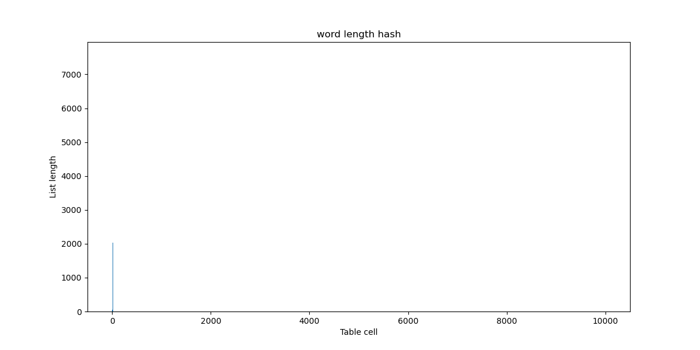

# Лабораторная работа по изучению свойств хеш-таблиц

В нашей работе мы реализуем хеш-таблицу с закрытой адресацией методом цепочек. При такой реализации, таблица будет состоять из ячеек, каждая из которых будет хранить указатель на начало некоторого списка (списки будут нужны для избежания коллизий). 


Если мы захотим вставить элемент в таблицу, то с помощью хеш-функции мы сможем рассчитать индекс списка, в который попадет наш элемент. Корневым элементом списка назовем ячейку, в которой будем хранить ```nullptr```, список нулевой длины будет состоять из единственной такой ячейки, а сама она характеризует конец списка. При вставлении некоторого ключа в список, будем всегда вставлять его перед корневым элементом. Чтобы избежать дубликаты в таблице, при добавлении нового элемента мы должны будем проверять весь список на наличие этого элемента, и лишь затем вставлять. 


Становится ясно, что скорость добавления элемента будет расти вместе с длиной списка. Таким образом наша хеш-функция должна распределять элементы по спискам в таблице максимально равномерно, чтобы длина этих самых списков оставалась минимальной. Давайте выясним, какая хеш-функция имеет наилучшее распределение.

## Распределения разных хеш-функций

Для того чтобы получить более заметную статистику, мы должны сильно переполнить нашу хеш-таблицу. Сойдемся на том, что load-фактор должен быть равен примерно 5. То есть чтобы сделать вывод о равномерном распределении хеш-функции, каждый список должен будет хранить хотя-бы несколько элементов. Определим за размер нашей таблицы ~10000, а вставлять в нее будем ~50000 разных слов, хранящихся в файле ```assets/input/50k_in.txt```. Уточню, что размер таблицы должен быть простым числом, поэтому под обозначением ~10000 подразумевается близкое к 10000 простое число. 

Помимо сравнения распределений с помощью графиков, удобно будет посчитать дисперсию для каждой функции: $$D^2 = \frac{\sum (a_{avg} - a_i)^2}{N}$$

Сравнивать будем данные хеш-функции:
1. [ConstHash](#const) (вернет константу)
2. [FirstLetterHash](#fst_let) (вернет ASCII код первой буквы)
3. [ASCII_SumHash](#sum) (вернет сумму ASCII кодов букв)
4. [StrLenHash](#strlen) (вернет длину слова)
5. [ROR_Hash](#ror) (подсчет хеша с помощью битового поворота числа вправо)
6. [ROL_Hash](#rol) (подсчет хеша с помощью битового поворота числа влево)
7. [CRC32_Hash](#crc32) (подсчет хеша алгоритмом CRC32)

<a name="const"></a> 
### ConstHash

Данная хеш-функция всегда будет возвращать одно и то же число, вне зависимости от параметра.

```cpp
u_int32_t ConstHash(const char* key)
{
    return 1337;
}
```

Построив график мы увидим, что в нем единственный столбец не имеет нулевую высоту. Сразу обрежем масштаб по горизонтальной оси и посмотрим на результат.


Можно сделать вывод, что это ужасная хеш-функция, ведь она сводит всю хеш-таблицу в единственный список. В таком случае добавление каждого нового элемента будет занимать $O(n)$.

$$D = 528.670654$$

<a name="fst_let"></a> 
### FirstLetterHash

Эта хеш-функция будет возвращать ASCII код первой буквы полученного слова.
```cpp
u_int32_t FirstLetterHash(const char* key)
{
    return key[0];
}
```


Уже заметно, что эта хеш-функция плохо распределяет на большом массиве, давайте приблизим график чтобы понять причину.


Теперь становится ясно, что такое распределение связано с тем, что значения лежат в диапазоне из 25 разных ASCII кодов для латинского алфавита. Это уже лучше чем просто константная хеш-функция, но на больших размерах хеш-таблицы все так же плохо.

$$D = 127.684868$$

<a name="sum"></a> 
### ASCII_SumHash

Теперь рассмотрим функцию, которая вернет сумму ASCII кодов каждого символа в слове.
```cpp
u_int32_t ASCII_SumHash(const char* key)
{
    size_t len = strlen(key);

    u_int32_t sum = 0;

    for (size_t i = 0; i < len; i++)
        sum += key[i];

    return sum;
}
```

Ради интереса протестируем ее сначала при маленьком размере таблицы. Уменьшим размер таблицы до ~500, а также уменьшим набор входных данных до ~2500 слов.


$$D_{small} = 2.774288$$ 

Очень хороший результат по сравнению с тем что было раньше. Возможно эту хеш-функцию стоит использовать и в дальнейшей работе. Давайте удостоверимся, проверив ее распределение на большой таблице.


Произошло что-то очень плохое, давайте приблизим и узнаем причину.


На этом графике заметно, что распределение состоит из множества пиков. Это связано с тем, что минимальный ASCII код у буквы 'a' равен 97. То есть слова разной длины будут заметно отличаться по сумме ASCII кодов. Списки с индексом более 2000 оказываются вообще почти пустыми. В наборе наших данных банально нет слов достаточной длины, для того чтобы покрыть эти значения.

$$D_{big} = 19.739456$$

Дисперсия подтверждает факт того, что на больших размерах функция ведет себя очень плохо.

С чем же связана такая разница в поведении в зависимости от размера таблицы? На малых размерах сумма может "завернуться" так, чтобы переполнив размер таблицы, покрыть зазор между пиками и распределиться по всему диапазону. При больших размерах такой возможности нет, поэтому мы получим ярко выраженные пики и "перекошенные" влево длины списков.

Можно сделать вывод, что это достаточно "коварная" функция. На малых размерах (порядка 500) она ведет себя достаточно хорошо, и некоторым может показаться что её стоит использовать, но для больших по размеру таблиц она уже не подойдет.

<a name="strlen"></a> 
### StrLenHash

Данная хеш-функция возвращает как значение длину слова.

```cpp
u_int32_t StrLenHash(const char* key)
{
    u_int32_t len = strnlen(key, MAX_KEY_LEN);

    return len;
}
```

Можем увидеть, что все значения сконцентрированы в крайне маленьком диапазоне.

Из данного графика мы можем сделать выводы, слова какой длины встречаются чаще всего. Слова длины более 15 букв можно считать редкостью, причем слова некоторой длины могут встречаться чаще остальных. Из-за этих особенностей эта функция точно не подойдет для использования в хеш-таблицах.

$$D = 166.334564$$ 

<a name="ror"></a> 
### ROR_Hash

Данная функция считает хеш используя команду ```ror```. Эту команду называют вращением числа, последняя буква (в нашем случае r) определяет направление вращения вправо. При использовании этой команды, все биты числа передвигаются вправо, а самый правый бит переходит в начало. Реализуем данную команду с помощью своей функции на языке Си.

```cpp
uint32_t Ror(uint32_t num)
{
    return ((num >> 1)) | (num << 31);
}
```

Фактически мы реализовали ассемблерную команду с помощью функции. Ради интереса можно посмотреть, догадается ли компилятор заменить эту функцию одной командой. Сначала рассмотрим версию без флагов оптимизации:


Компилятор догадался и обнаружил команду ror даже без флагов оптимизаций, сравним что получится с флагами:


Компилятор упростил код, оставив важную для нас оптимизацию.

```cpp
u_int32_t ROR_Hash(const char* key)
{
    u_int32_t hash = 0;

    size_t size = strnlen(key, MAX_KEY_LEN);

    for (size_t i = 0; i < size; i++)
    {
        hash = Ror(hash) ^ key[i];
    }

    return hash;
}
```

Эту хеш-функцию уже уверенно можно причислить к числу хороших. Как заметно на графике, она покрывает все значения от 0 до ~10000 примерно равномерно, если не считать единичных пиков. 

$$D = 5.725509$$

<a name="rol"></a> 
### ROL_Hash

Эта хеш-функция почти ничем не отличается от предыдущей, помимо того что она использует команду ```rol```, которая проворачивает число влево. Реализуем функцию поворота влево таким образом:

```cpp
uint32_t Rol(uint32_t num)
{
    return ((num << 1)) | (num >> 31);
}
```

Проведем такой же эксперимент как в прошлом пункте. Без оптимизаций компилятор выдаст данный код:


Теперь с оптимизацией:


Все аналогично прошлой функции, компилятор может заметить команду поворота и заменить на команду ```rol```.

```cpp
u_int32_t ROL_Hash(const char* key)
{
    u_int32_t hash = 0;

    size_t size = strnlen(key, MAX_KEY_LEN);

    for (size_t i = 0; i < size; i++)
    {
        hash = Rol(hash) ^ key[i];
    }

    return hash;
}
```

Аналогично с прошлой хеш-функцией, мы получаем хорошее и равномерное распределение по всему диапазону индексов.

$$D = 3.861122$$

<a name="crc32"></a> 
### CRC32_Hash

Данная хеш-функция использует алгоритм, называемый [CRC](https://en.wikipedia.org/wiki/Cyclic_redundancy_check).

```cpp
u_int32_t CRC32_Hash(const char* key)
{
    uint32_t crc = -1;
    int      i   =  0;

    while (key[i] != 0)
    {
        crc = crc ^ (key[i] << 24);
        for (int bit = 0; bit < 8; bit++)
        {
            if (crc & (1L << 31))
                crc = (crc << 1) ^ 0x04C11DB7;
            else
                crc = (crc << 1);
        }

        i++;
    }
    return ~crc;
}
```
Построив график, получим:

Визуально заметно, что это самое равномерное распределение из всех, рассмотренных нами ранее. Эту функцию мы и будем использовать в дальнейшей работе, как самую лучшую из рассмотренных.

$$D = 2.300847$$

Дисперсия так же подтверждает наш вывод о результатах функций.

### Промежуточный итог

Из всех рассмотренных нами хеш-функцией, ```CRC32_Hash```, ```ROL_Hash``` и ```ROR_Hash``` действительно имеют хорошее распределение и их можно использовать для таблиц любого размера. Также имеет смысл отметить функцию ```ASCII_SumHash```. Несмотря на то, что она плохо работает для больших хеш-таблиц, для таблиц размера ~500 ее вполне можно использовать, как равномерную и легкую в написании. Лучшей же среди всех функций будем считать ```CRC32_Hash```.

Зависимость дисперсий от выбора хеш-функций:


| Хеш-функция                 | Дисперсия                                                       |
|:---------------------------:|:---------------------------------------------------------------:|
| [CRC32_Hash](#crc32)        | 2.300847                                                        |
| [ASCII_SumHash](#sum)       | 2.774288 / 19.739456 <br> (маленькая таблица / большая таблица) |
| [ROL_Hash](#rol)            | 3.861122                                                        |
| [ROR_Hash](#ror)            | 5.725509                                                        |
| [FirstLetterHash](#fst_let) | 127.684868                                                      |
| [StrLenHash](#strlen)       | 166.334564                                                      |
| [ConstHash](#const)         | 528.670654                                                      | 


