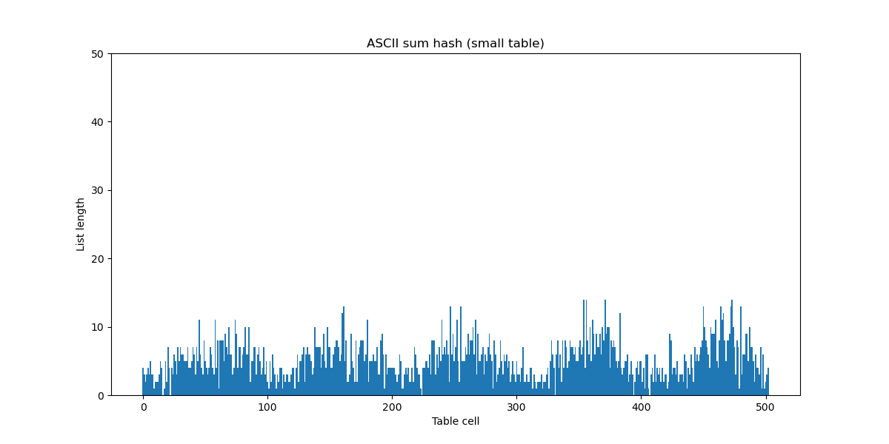

# Лабораторная работа по изучению свойств хеш-таблиц

В нашей работе мы реализуем хеш-таблицу с закрытой адресацией методом цепочек. При такой реализации, таблица будет состоять из ячеек, каждая из которых будет хранить указатель на начало некоторого списка (списки будут нужны для избежания коллизий). 

|  |
| :-: |
| [Рис.1] Схема хеш-таблицы с закрытой адресацией (Источник: [вики-итмо](https://neerc.ifmo.ru/wiki/index.php?title=Разрешение_коллизий)) |

Если мы захотим вставить элемент в таблицу, то с помощью хеш-функции мы сможем рассчитать индекс списка, в который попадет наш элемент. Корневым элементом списка назовем ячейку, в которой будем хранить ```nullptr```, список нулевой длины будет состоять из единственной такой ячейки, а сама она характеризует конец списка. При вставлении некоторого ключа в список, будем всегда вставлять его перед корневым элементом. Чтобы избежать дубликаты в таблице, при добавлении нового элемента мы должны будем проверять весь список на наличие этого элемента, и лишь затем вставлять. 

|  |
| :-:|
| [Рис.2] Схема списка в хеш-таблице |

Становится ясно, что скорость добавления элемента будет расти вместе с длиной списка. Таким образом наша хеш-функция должна распределять элементы по спискам в таблице максимально равномерно, чтобы длина этих самых списков оставалась минимальной. Давайте выясним, какая хеш-функция имеет наилучшее распределение.

## Распределения разных хеш-функций

Для того чтобы получить более заметную статистику, мы должны сильно переполнить нашу хеш-таблицу. Сойдемся на том, что load-фактор должен быть равен примерно 5. То есть чтобы сделать вывод о равномерном распределении хеш-функции, каждый список должен будет хранить хотя-бы несколько элементов. Определим за размер нашей таблицы ~10000, а вставлять в нее будем ~50000 разных слов, хранящихся в файле ```assets/input/50k_in.txt```. Уточню, что размер таблицы должен быть простым числом, поэтому под обозначением ~10000 подразумевается близкое к 10000 простое число. 

Помимо сравнения распределений с помощью графиков, удобно будет посчитать дисперсию для каждой функции: $$D^2 = \frac{\sum (a_{avg} - a_i)^2}{N}$$

Сравнивать будем данные хеш-функции:
1. [ConstHash](#const) (вернет константу)
2. [FirstLetterHash](#fst_let) (вернет ASCII код первой буквы)
3. [ASCII_SumHash](#sum) (вернет сумму ASCII кодов букв)
4. [StrLenHash](#strlen) (вернет длину слова)
5. [ROR_Hash](#ror) (подсчет хеша с помощью битового поворота числа вправо)
6. [ROL_Hash](#rol) (подсчет хеша с помощью битового поворота числа влево)
7. [CRC32_Hash](#crc32) (подсчет хеша алгоритмом CRC32)

<a name="const"></a> 
### ConstHash

Данная хеш-функция всегда будет возвращать одно и то же число, вне зависимости от параметра.

```cpp
u_int32_t ConstHash(const char* key)
{
    return 1337;
}
```

Построив график мы увидим, что в нем единственный столбец не имеет нулевую высоту. Сразу обрежем масштаб по горизонтальной оси и посмотрим на результат.

|  |
| :-: |
| [Рис.3] Распределение константного хеша |

Можно сделать вывод, что это ужасная хеш-функция, ведь она сводит всю хеш-таблицу в единственный список. В таком случае добавление каждого нового элемента будет занимать $O(n)$.

$$D = 528.67$$

<a name="fst_let"></a> 
### FirstLetterHash

Эта хеш-функция будет возвращать ASCII код первой буквы полученного слова.
```cpp
u_int32_t FirstLetterHash(const char* key)
{
    return key[0];
}
```

|  |
| :-: |
| [Рис.4] Распределение хеша первой буквы (бол. масштаб) |

Уже заметно, что эта хеш-функция плохо распределяет на большом массиве, давайте приблизим график чтобы понять причину.

|  |
| :-: |
| [Рис.5] Распределение хеша первой буквы (мал. масштаб) |

Теперь становится ясно, что такое распределение связано с тем, что значения лежат в диапазоне из 25 разных ASCII кодов для латинского алфавита. Это уже лучше чем просто константная хеш-функция, но на больших размерах хеш-таблицы все так же плохо.

$$D = 127.68$$

<a name="sum"></a> 
### ASCII_SumHash

Теперь рассмотрим функцию, которая вернет сумму ASCII кодов каждого символа в слове.
```cpp
u_int32_t ASCII_SumHash(const char* key)
{
    size_t len = strlen(key);

    u_int32_t sum = 0;

    for (size_t i = 0; i < len; i++)
        sum += key[i];

    return sum;
}
```

Ради интереса протестируем ее сначала при маленьком размере таблицы. Уменьшим размер таблицы до ~500, а также уменьшим набор входных данных до ~2500 слов.

|  |
| :-: |
| [Рис.6] Распределение хеша суммы букв (мал. размер) |

$$D_{small} = 2.77$$ 

Очень хороший результат по сравнению с тем что было раньше. Возможно эту хеш-функцию стоит использовать и в дальнейшей работе. Давайте удостоверимся, проверив ее распределение на большой таблице.

|  |
| :-: |
| [Рис.7] Распределение хеша суммы букв (бол. размер, бол. масштаб) |

Произошло что-то очень плохое, давайте приблизим и узнаем причину.

|  |
| :-: |
| [Рис.8] Распределение хеша суммы букв (бол. размер, мал. масштаб) |

По нескольким причинам хеш-функция стала плохо работать:

1) Списки с индексом более 2000 оказываются пустыми. В наборе наших данных банально нет слов достаточной длины, для того чтобы покрыть эти значения.
2) Распределение состоит из множества пиков. Это связано с тем, что минимальный ASCII код у буквы 'a' равен 97. То есть слова разной длины будут заметно отличаться по сумме ASCII кодов.

$$D_{big} = 19.73$$

Дисперсия подтверждает факт того, что на больших размерах функция ведет себя очень плохо.

С чем же связана такая разница в поведении в зависимости от размера таблицы? На малых размерах сумма может "завернуться" так, чтобы переполнив размер таблицы, покрыть зазор между пиками и распределиться по всему диапазону. При больших размерах такой возможности нет, поэтому мы получим ярко выраженные пики и "перекошенные" влево длины списков.

Можно сделать вывод, что это достаточно "коварная" функция. На малых размерах (порядка 500) она ведет себя достаточно хорошо, и некоторым может показаться что её стоит использовать, но для больших по размеру таблиц она уже не подойдет.

<a name="strlen"></a> 
### StrLenHash

Данная хеш-функция возвращает как значение длину слова.

```cpp
u_int32_t StrLenHash(const char* key)
{
    u_int32_t len = strnlen(key, MAX_KEY_LEN);

    return len;
}
```
| [](assets/pictures/strlen_far.png) |
| :-: |
| [Рис.9] Распределение хеша длины слова (бол. масштаб) |

Можем увидеть, что все значения сконцентрированы в крайне маленьком диапазоне.

|  |
| :-: |
| [Рис.10] Распределение хеша длины слова (мал. масштаб) |

Из данного графика мы можем сделать выводы, слова какой длины встречаются чаще всего. Слова длины более 15 букв можно считать редкостью, причем слова некоторой длины могут встречаться чаще остальных. Из-за этих особенностей эта функция точно не подойдет для использования в хеш-таблицах.

$$D = 166.33$$ 

<a name="ror"></a> 
### ROR_Hash

Данная функция считает хеш используя команду ```ror```. Эту команду называют вращением числа, последняя буква (в нашем случае r) определяет направление вращения вправо. При использовании этой команды, все биты числа передвигаются вправо, а самый правый бит переходит в начало. Реализуем данную команду с помощью своей функции на языке Си.

```cpp
uint32_t Ror(uint32_t num)
{
    return ((num >> 1)) | (num << 31);
}
```

Фактически мы реализовали ассемблерную команду с помощью функции. Ради интереса можно посмотреть, догадается ли компилятор заменить эту функцию одной командой. Сначала рассмотрим версию без флагов оптимизации:

|  |
| :-: |
| [Рис.11] Компиляция поворота вправо (без флагов) |

Компилятор догадался и обнаружил команду ror даже без флагов оптимизаций, сравним что получится с флагами:

|  |
| :-: |
| [Рис.12] Компиляция поворота вправо (с флагами) |

Компилятор упростил код, оставив важную для нас оптимизацию.

```cpp
u_int32_t ROR_Hash(const char* key)
{
    u_int32_t hash = 0;

    size_t size = strnlen(key, MAX_KEY_LEN);

    for (size_t i = 0; i < size; i++)
    {
        hash = Ror(hash) ^ key[i];
    }

    return hash;
}
```
|  |
| :-: |
| [Рис.13] Распределение хеша правого поворота |

Эту хеш-функцию уже уверенно можно причислить к числу хороших. Как заметно на графике, она покрывает все значения от 0 до ~10000 примерно равномерно, если не считать единичных пиков. 

$$D = 5.72$$

<a name="rol"></a> 
### ROL_Hash

Эта хеш-функция почти ничем не отличается от предыдущей, помимо того что она использует команду ```rol```, которая проворачивает число влево. Реализуем функцию поворота влево таким образом:

```cpp
uint32_t Rol(uint32_t num)
{
    return ((num << 1)) | (num >> 31);
}
```

Проведем такой же эксперимент как в прошлом пункте. Без оптимизаций компилятор выдаст данный код:

|  |
| :-: |
| [Рис.14] Компиляция поворота влево (без флагов) |

Теперь с оптимизацией:

|  |
| :-: |
| [Рис.15] Компиляция поворота влево (с флагами) |

Все аналогично прошлой функции, компилятор может заметить команду поворота и заменить на команду ```rol```.

```cpp
u_int32_t ROL_Hash(const char* key)
{
    u_int32_t hash = 0;

    size_t size = strnlen(key, MAX_KEY_LEN);

    for (size_t i = 0; i < size; i++)
    {
        hash = Rol(hash) ^ key[i];
    }

    return hash;
}
```
|  |
| :-: |
| [Рис.16] Распределение хеша левого поворота |

Аналогично с прошлой хеш-функцией, мы получаем хорошее и равномерное распределение по всему диапазону индексов.

$$D = 3.86$$

<a name="crc32"></a> 
### CRC32_Hash

Данная хеш-функция использует алгоритм, называемый [CRC](https://en.wikipedia.org/wiki/Cyclic_redundancy_check).

```cpp
u_int32_t CRC32_Hash(const char* key)
{
    uint32_t crc = -1;
    int      i   =  0;

    while (key[i] != 0)
    {
        crc = crc ^ (key[i] << 24);
        for (int bit = 0; bit < 8; bit++)
        {
            if (crc & (1L << 31))
                crc = (crc << 1) ^ 0x04C11DB7;
            else
                crc = (crc << 1);
        }

        i++;
    }
    return ~crc;
}
```
Построив график, получим:

|  |
| :-: |
| [Рис.17] Распределение хеша CRC32 |

Визуально заметно, что это самое равномерное распределение из всех, рассмотренных нами ранее. Эту функцию мы и будем использовать в дальнейшей работе, как самую лучшую из рассмотренных.

$$D = 2.30$$

Дисперсия так же подтверждает наш вывод о результатах функций.

### Промежуточный итог

Зависимость дисперсий от выбора хеш-функций:


| Хеш-функция                 | Дисперсия                                                       |
|:---------------------------:|:---------------------------------------------------------------:|
| [CRC32_Hash](#crc32)        | 2.30                                                            |
| [ASCII_SumHash](#sum) (мал.) | 2.77                                                           |
| [ROL_Hash](#rol)            | 3.86                                                            |
| [ROR_Hash](#ror)            | 5.72                                                            |
| [ASCII_SumHash](#sum) (бол.) | 19.74                                                          |
| [FirstLetterHash](#fst_let) | 127.68                                                          |
| [StrLenHash](#strlen)       | 166.33                                                          |
| [ConstHash](#const)         | 528.67                                                          | 

Из всех рассмотренных нами хеш-функцией, ```CRC32_Hash```, ```ROL_Hash``` и ```ROR_Hash``` действительно имеют хорошее распределение и их можно использовать для таблиц любого размера. Также имеет смысл отметить функцию ```ASCII_SumHash```. Несмотря на то, что она плохо работает для больших хеш-таблиц, для таблиц размера ~500 ее вполне можно использовать, как равномерную и легкую в написании. Лучшей же среди всех функций будем считать ```CRC32_Hash```.

## Оптимизации для хеш-таблицы.

Мы рассмотрели распределение нескольких хеш-функций, теперь же имеет смысл сфокусироваться на времени работы программы. Для того чтобы его узнать, заполним хеш-таблицу набором из 370000 разных слов (файл ```370k_in.txt```). Параллельно с заполнением таблицы сохраним эти слова в массиве. После этого будем пропускать 100 раз массив из этих слов, запуская функцию поиска выбранного нами слова в хеш-таблице. Чтобы проверять корректность работы, будем считать за $val$ номер слова по порядку в словаре. Получая это значение будем сравнивать его с индексом этого слова в массиве, и эти номера должны совпасть. 

Делать замеры будем с помощью ассемблерной команды ```rdtsc```. Благодаря ней мы сможем измерить разницу тактов между началом и концом нужного нам алгоритма, найденная разница как раз будет характеризовать время его работы. Запускать программу будем 3 раза, а затем вычислять среднее значение тактов по методу наименьших квадратов. Компилировать любой запуск будем с флагами ```-O3 -mavx2```.

Описанным образом измерим время работы нашей программы. Обозначим за $t_i$ количество тактов в измерении, где $i$ это номер измерения. $t_{avg}$ будет средним количеством тактов по трём измерениям, посчитанное с помощью МНК.

|  Версия программы  |   $t_1$       | $t_2$         | $t_3$         | $t_{avg}$                   |
|:------------------:|:-------------:|:-------------:|:-------------:|:---------------------------:|
| Без оптимизаций    | $61933960366$ | $60676206064$ | $61926101368$ | $(61.5 \pm 1.0) \cdot 10^9$ |

Характерное время работы ~ 30 секунд.

### Первая оптимизация (intrinsic)

Попробуем улучшить данный результат. С этим нам поможет программа [valgrind](https://valgrind.org/docs/manual/cl-manual.html). С помощью команды в консоли ```valgrind  --tool=callgrind ./table```, где ```./table``` это исполняемый файл нашей программы, мы сможем получить файл с характеристикой работы каждой функции. Для просмотра этого файла воспользуемся утилитой [kcachegrind](https://kcachegrind.sourceforge.net/html/Home.html). Таким образом получим вот такие сведения о работе наших функций:

| |
| :-: |
| [Рис.18] Затратные функции в хеш-таблице без оптимизаций |

Можем увидеть, что самая затратная функция - подсчет хеша $CRC32_Hash$. В связи с этим нам следует заняться её оптимизацией.

Результат распределения рассмотренной нами [хеш-функции](#strlen) позволяет нам заметить, что длина слов в нашем наборе не превышает 32. С этого момента имеет смысл предполагать, что все слова в нашей хеш-таблице имеют длину не более 32 букв, иначе же, мы будем помещать их во вторую хеш-таблицу. Но во вторую хеш-таблицу будет помещаться очень малое количество слов (если набор наших данных будет связан с английским языком), поэтому такой заменой мы почти никак не повлияем на скорость. 

Стоит вспомнить, что имеется intrinsic функция ```_mm_crc32_u32```, возвращаюшая хеш по алгоритму crc32. Оптимизируем функцию подчета хеша, посчитав его с помощью intrinsic функций, а так же считая что все слова дополнены до 32 букв.

```cpp
uint32_t Fast_CRC32_Hash(const char* key)
{
    assert(key);

    uint32_t hash = 0;

    hash = _mm_crc32_u64(hash, *((uint64_t*) key));
    hash = _mm_crc32_u64(hash, *((uint64_t*) key + 1));
    hash = _mm_crc32_u64(hash, *((uint64_t*) key + 2));
    hash = _mm_crc32_u64(hash, *((uint64_t*) key + 3));

    return hash;
}
```

Дополним нашу таблицу измерений.

|  Версия программы  |   $t_1$       | $t_2$         | $t_3$         | $t_{avg}$                   |
|:------------------:|:-------------:|:-------------:|:-------------:|:---------------------------:|
| Без оптимизаций    | $61933960366$ | $60676206064$ | $61926101368$ | $(61.5 \pm 1.0) \cdot 10^9$ |
| Intrinsic crc32    | $36129613314$ | $36106511268$ | $35348591830$ | $(35.8 \pm 0.5) \cdot 10^9$ |

Характерное время работы ~ 20 секунд.  

Можем посчитать ускорения для первой оптимизации. Абсолютным будем называть ускорение, рассчитываемое относительно первоначальной версии. Относительным же будет ускорение относительно предыдущей версии программы.

| Версия программы | Абсолютное ускорение | Относительное ускорение |
| :--------------: | :------------------: | :---------------------: |
| Без оптимизаций  |        $1.0$         |            $1.0$        |
| Intrinsic crc32  |  $1.72 \pm 0.08$     |  $1.72 \pm 0.08$        |

Ради интереса, сравним распределение оптимизированной нами хеш-функции с распределением, найденным ранее.

| |
| :-: |
| [Рис.19] Распределение оптимизированной хеш-функции |

$$D = 2.25$$

Получаем, что данная реализация возможно работает быстрее в том числе благодаря более равномерному распределению.

### Вторая оптимизация (ассемблерная вставка)

Снова найдем функцию, тормозящую выполнение программы, с помощью ```valgrind```.

| |
| :-: |
| [Рис.20] Затратные функции в хеш-таблице после первой оптимизации |

Теперь дольше всего исполняется стандартная функция ```__strcmp_sse2_unaligned```. Найдем место, где она вызывается.

```cpp
node_t* FindKeyInList(node_t* root_cell, const char* key)
{
    ...
    while (cell->key != nullptr)
    {
        if (strcmp(cell->key, key) == 0)
            return cell;

        ...
    }

}
```

Как мы видим, эта функция используется в единственном месте, для того чтобы сравнить совпадают ли ключи. Можем оптимизовать её, реализовав свою функцию с некоторыми особенностями:

1) Мы ранее договорились дополнять слова до размера 32 букв, значит, наши слова могут идеально помещаться в регистре ```ymm0```. Давайте же будем класть наши слова в эти регистры, а затем сравнивать их содержимое с помощью инструкции ```vptest```.
2) Нас уже не интересует, насколько отличаются слова и какое из них лексиграфически должно идти первее. Постараемся ограничить лишние вычисления и возвращать только 2 разных числа: 0 если строки совпадают, не 0 если отличаются. Причем возвращаемое число, если оно не равно 0, фактически не будет иметь никакого смысла в плане характера различия наших строк.

Используя данные идеи, реализуем свою функцию сравнения слов с помощью ассемблерной вставки.

```cpp
static inline int _StrCmp(const char* key1, const char* key2)
{
    assert(key1);
    assert(key2);

    int result = 0;

    asm inline
    (
        ".intel_syntax noprefix\n"
        "xor        %0, %0\n"                   // result = 0
        "vmovdqu    ymm0, YMMWORD PTR [%1]\n"   // place str1 in ymm0
        "vptest     ymm0, YMMWORD PTR [%2]\n"   // compare registers
        "setnc      %b0\n"                      // set bit if CF == 0
        "vzeroupper\n"
        ".att_syntax prefix\n"
        : "=&r" (result)
        : "r" (key1), "r" (key2)
        : "ymm0", "cc"
    );

    return result;
}
```

Что же значит команда ```vzeroupper``` в конце вставки? [Заявляется](https://www.felixcloutier.com/x86/vzeroupper), что она очищает верхнюю половину векторного регистра, что в дальнейшем позволяет избежать задержки при переходе с AVX инструкций на SSE инструкции. Давайте проведем измерения и узнаем, правда ли она влияет на производительность программы.

|  Версия программы       |   $t_1$       | $t_2$         | $t_3$         | $t_{avg}$                   |
|:-----------------------:|:-------------:|:-------------:|:-------------:|:---------------------------:|
| asm strcmp              | $21617596190$ | $23359304322$ | $22169181334$ | $(22.5 \pm 1.0) \cdot 10^9$ |
| asm strcmp + vzeroupper | $22582716722$ | $22035352200$ | $22404409400$ | $(22.3 \pm 0.5) \cdot 10^9$ |

Характерное время работы ~ 10-15 секунд.

Как мы видим, разница в скорости между этими случаями не так велика. Оставим инструкцию ```vzeroupper``` на случай, если она поможет в дальнейшем. Теперь посчитаем ускорение этой оптимизации относительно предыдущих. 

| Версия программы | Абсолютное ускорение | Относительное ускорение |
| :--------------: | :------------------: | :---------------------: |
| Без оптимизаций  |        $1.0$         |            $1.0$        |
| Intrinsic crc32  |  $1.72 \pm 0.08$     | $1.72 \pm 0.08$         |
| Asm strcmp       |  $2.75 \pm 0.17$     | $1.60 \pm 0.12$         |

### Третья оптимизация (функция на ассемблере)

Вновь проделаем тот же алгоритм, что и в предыдущие разы. Проанализируем скорость нашей программы с помощью утилиты ```valgrind```.

| |
| :-: |
| [Рис.21] Затратные функции в хеш-таблице после второй оптимизации |

Теперь же больше всего по времени работает функция ```HashtableGet```, которая ищет ключ по запросу в таблице. Давайте рассмотрим её код.

```cpp
int HashtableGet(hashtable_t* table, const char* key)
{
    assert(key);
    assert(table);

    size_t index = GetKeyIndex(table, key);        // returns hash-function result
    node_t* root_cell = table->cells[index];

    node_t* key_node = FindKeyInList(root_cell, key);

    if (key_node->key != nullptr)
        return key_node->val;

    return UNKNOWN_VAL;
}
```

Единственную возможность оптимизации этой функции можно заметить в вызываемой внутри неё ```FindKeyInList```, которая ищет элемент в списке. 

```cpp
node_t* FindKeyInList(node_t* root_cell, const char* key)
{
    node_t* cell = root_cell;

    while (cell->key != nullptr)
    {
        if (_StrCmp(cell->key, key) == 0)
            return cell;

        cell = cell->next;
    }

    return cell;
}
```

С помощью [godbolt](https://godbolt.org) узнаем, во что компилируется эта функция при флаге оптимизации ```-O3```.

```nasm
        mov     rdx, QWORD PTR [rdi]               ; rdx = root_cell
        mov     rax, rdi                           ;  |
        test    rdx, rdx                           ;  | return root_cell if cell->key == 0, rax = cur_cell
        jne     .L3                                ;  |
        ret
.L10:
        mov     rax, QWORD PTR [rax+16]            ; cur_cell = cur_cell->next
        mov     rdx, QWORD PTR [rax]               ; rdx = cur_cell->key
        test    rdx, rdx
        je      .L1                                ; return (rax = cur_cell)
.L3:
        .intel_syntax noprefix                     ;  |
        xor        ecx, ecx                        ;  |
        vmovdqu    ymm0, YMMWORD PTR [rdx]         ;  |
        vptest     ymm0, YMMWORD PTR [rsi]         ;  |    Inlined strcmp
        setnc      cl                              ;  |
        vzeroupper                                 ;  |

        test    ecx, ecx                           ; return if strcmp == 0
        jne     .L10
.L1:
        ret
```

Заметим сразу две возможные оптимизации:
1) Давайте вместо того, чтобы в каждом заходе цикла класть в ```ymm0``` новое слово, положим в него самом начале строку ```key```, а затем уже будем в цикле сравнивать этот регистр со словами в ячейках списка. 
2) Нам не нужно исполнять команду ```vzeroupper``` после каждого цикла, так как в промежутке между ними мы не переходим на использование SSE инструкций. Имеет смысл использовать ```vzeroupper``` единожды перед выходом из функции.

Пользуясь данными выводами напишем в отдельном файле ```findkey.s``` свою ассемблерную функцию поиска ключа в списке.

```nasm
_FindKey:           mov     rdx, QWORD [rdi]            ; rdx = root_cell
                    vmovdqu ymm0, YWORD [rsi]           ; ymm0 = key
                    mov     rax, rdi                    ;  |
                    test    rdx, rdx                    ;  | return root_cell if cell->key == 0, rax = cur_cell
                    jne     .COMPARE_KEYS               ;  |
                    ret
.LOOP_LIST:
                    mov     rax, QWORD [rax + 16]       ; cur_cell = cur_cell->next
                    mov     rdx, QWORD [rax]            ; rdx = cur_cell->key
                    test    rdx, rdx
                    je      .RETURN                     ; return (rax = cur_cell)
.COMPARE_KEYS:
                    xor        ecx, ecx                 ;  |
                    vptest     ymm0, YWORD [rdx]        ;  |    Inlined strcmp
                    setnc      cl                       ;  |

                    test    ecx, ecx                    ; return if strcmp == 0
                    jne     .LOOP_LIST
.RETURN:
                    vzeroupper
                    ret
```

Теперь протестируем время исполнения данной функции.

|  Версия программы          |   $t_1$       | $t_2$         | $t_3$         | $t_{avg}$                   |
|:--------------------------:|:-------------:|:-------------:|:-------------:|:---------------------------:|
| Поиск ключа в списке (asm) | $19632116282$ | $19148328314$ | $18843343012$ | $(19.2 \pm 0.5) \cdot 10^9$ |

Характерное время работы ~ 10 секунд.

| Версия программы           | Абсолютное ускорение | Относительное ускорение |
| :------------------------: | :------------------: | :---------------------: |
| Без оптимизаций            |        $1.0$         |            $1.0$        |
| Intrinsic crc32            |  $1.72 \pm 0.08$     | $1.72 \pm 0.08$         |
| Asm strcmp                 |  $2.75 \pm 0.17$     | $1.60 \pm 0.12$         |
| Поиск ключа в списке (asm) |  $3.20 \pm 0.22$     | $1.17 \pm 0.11$         |

Мы получаем уже сравнительно малое относительное ускорение, а это значит, что на этой оптимизации можно остановиться. При дальнейших действиях мы лишь сильно усложним код, но выиграем сравнительно мало времени. 

### Анализ оптимизаций

Как известно, оптимизации дают выигрыш во скорости работы программы, но зачастую слишком усложняют её читабельность. Давайте введем коэффицент, учитывающий эти факторы, и с помощью этого коэффициента сравним проделанные нами оптимизации.

$$K = \frac{T_{before}}{T_{after}} \cdot \frac{1}{N_{strings}} \cdot 1000$$

| Версия программы           | $\frac{T_{before}}{T_{after}}$ | $N_{strings}$           |  $K$          |
| :------------------------: | :----------------------------: | :---------------------: | :-----------: |
| Intrinsic crc32            |   $1.72 \pm 0.08$              | 5                       | $344 \pm 16$  |
| Asm strcmp                 |   $1.60 \pm 0.12$              | 13                      | $123 \pm 9$   |
| Поиск ключа в списке (asm) |   $1.17 \pm 0.11$              | 20                      | $58  \pm 5$   |

В целом мои предположения подтвердились, оптимизация хеш-функции оказалась очень выгодной и удобной для чтения, в отличие от оптимизации функции поиска ключа. Можно сделать вывод, что ассмеблерную оптимизацию не всегда имеет смысл реализовывать, ведь она может не давать значительного ускорения программе, но при этом она будет сильно усложнять чтение и понимание кода человеку со стороны [Рис. 22].

| |
| :-: |
| [Рис.22] Пример видения кода с множеством оптимизаций (от лица стороннего человека) |

## Вывод

Подводя итог всей лабораторной работе, можно отметить, что на скорость работы хеш-таблицы достаточно сильно влияет распределение используемой хеш-функции. Равномерное распределение способно ускорить работу нашей программы в десятки раз. Но это не единственный способ ускорения хеш-таблицы. 

Имеет смысл использовать ассемблерные оптимизации, такие как intrinsic функции, вставки, реализация функций на ассемблере и прочее. Такие оптимизации способны ускорить работу программы более чем в 3 раза. Но не стоит забывать о читабельности кода, ведь в большинстве случаев оптимизации сильно усложняют понимание кода для человека со стороны, и в связи с этим могут нести больше вреда чем пользы.


