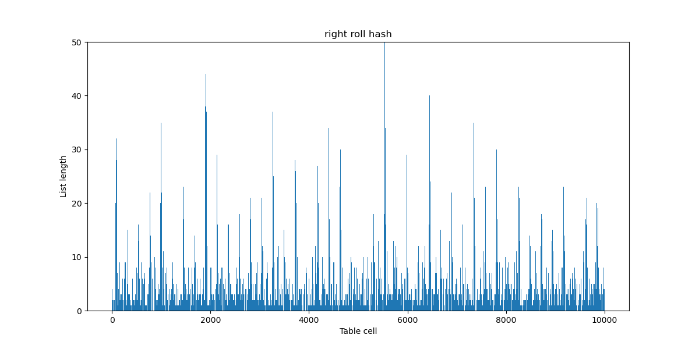

# Лабораторная работа по изучению свойств хэш-таблиц

В нашей работе мы реализуем хэш-таблицу с закрытой адресацией методом цепочки. При такой реализации, таблица будет состоять из ячеек, каждая из которых будет хранить указатель на начало некоторого списка (списки будут нужны для избежания коллизий). Если мы захотим вставить элемент в таблицу, то с помощью хэш-функции мы сможем рассчитать индекс списка, в который попадет наш элемент. Корневым элементом списка назовем ячейку, в которой будем хранить ```nullptr```, список нулевой длины будет состоять из единственной такой ячейки, а сама она характеризует конец списка. При вставлении некоторого ключа в список, будем всегда вставлять его перед корневым элементом. Чтобы избежать дубликаты в таблице, при добавлении нового элемента мы должны будем проверять весь список на наличие этого элемента, и лишь затем вставлять. Становится ясно, что скорость добавления элемента будет расти вместе с длиной списка. Таким образом наша хэш функция должна распределять элементы по спискам в таблице максимально равномерно, чтобы длина этих самых списков оставалась минимальной. Давайте выясним, какая хэш-функция имеет наилучшее распределение.

## Распределения разных хэш-функций

Для того чтобы получить более заметную статистику, мы должны сильно переполнить нашу хэш-таблицу. Сойдемся на том, что load-фактор должен быть равен примерно 5. То есть чтобы сделать вывод о равномерном распределении хэш-функции, каждый список должен будет хранить хотя-бы несколько элементов. Определим за размер нашей таблицы ~10000, а вставлять в нее будем ~50000 разных слов, хранящихся в файле ```assets/input/in.txt```. Уточню, что размер таблицы должен быть простым числом, поэтому под обозначением ~10000 подразумевается близкое к 10000 простое число. 

Помимо сравнения распределений с помощью графиков, удобно будет посчитать дисперсию для каждой функции: $$D^2 = \frac{\sum (a_{avg} - a_i)^2}{N}$$

Сравнивать будем данные хэш-функции:
1. ConstHash (вернет константу)
2. FirstLetterHash (вернет ASCII код первой буквы слова)
3. ASCII_SumHash (вернет сумму ASCII кодов слова)
4. StrLenHash (вернет длину слова)
5. ROR_Hash (подсчет хэша с помощью битового поворота числа вправо)
6. ROL_Hash (подсчет хэша с помощью битового поворота числа влево)
7. CRC32_Hash (подсчет хэша алгоритмом CRC32)

### ConstHash

Данная хэш-функция всегда будет возвращать одно и то же число, вне зависимости от параметра.

```
u_int32_t ConstHash(const char* key)
{
    return 1337;
}
```

Построив график мы увидим, что в нем единственный столбец не имеет нулевую высоту. Сразу обрежем масштаб по горизонтальной оси и посмотрим на результат.


Можно сделать вывод, что это ужасная хэш функция, ведь она сводит всю хэш таблицу в единственный список. В таком случае добавление каждого нового элемента будет занимать $O(n)$.

$$D = 528.670654$$

### FirstLetterHash

Эта хэш-функция будет возвращать ASCII код первой буквы полученного слова.
```
u_int32_t FirstLetterHash(const char* key)
{
    return key[0];
}
```


Уже заметно, что эта хэш-функция плохо распределяет на большом массиве, давайте приблизим график чтобы понять причину.


Теперь становится ясно, что такое распределение связано с тем, что значения лежат в диапазоне из 25 разных ASCII кодов для латинского алфавита. Это уже лучше чем просто константная хэщ-функция, но на больших размерах хэш таблицы все так же плохо.

$$D = 127.684868$$

### ASCII_SumHash

Теперь рассмотрим функцию, которая вернет сумму ASCII кодов каждого символа в слове.
```
u_int32_t ASCII_SumHash(const char* key)
{
    size_t len = strlen(key);

    u_int32_t sum = 0;

    for (size_t i = 0; i < len; i++)
        sum += key[i];

    return sum;
}
```


Это распределение заметно лучше предыдущих, но списки с индексом более 2000 оказались почти пусты.


На этом графике заметно, что распределение состоит из множества пиков. Это связано с тем, что минимальный ASCII код у буквы 'a' равен 97. То есть слова разной длины будут заметно отличаться по сумме ASCII кодов. 

$$D_{big} = 19.739456$$

Возможно мы сможем улучшить результат, если мы уменьшим размер хэш таблицы. Тогда сумма сможет "завернуться" так, чтобы переполнив размер таблицы, покрыть зазор между пиками. Уменьшим размер таблицы до ~500, а также уменьшим набор входных данных до ~2500 слов, после этого посмотрим на результат.


Пики все еще заметны, но стало гораздо лучше по сравнению с тем, что было ранее. 

$$D_{small} = 2.774288$$ 

Дисперсия заметно уменьшилась, что подтверждае.  

Можем сделать вывод, что данная хэш-функция достаточно хороша для хэш-таблиц малого размера (порядка 500), но для больших по размеру таблиц она уже не подойдет.

### StrLenHash

Данная хэш-функция возвращает как значение длину слова.

```
u_int32_t StrLenHash(const char* key)
{
    u_int32_t len = strnlen(key, MAX_KEY_LEN);

    return len;
}
```

Можем увидеть, что все значения сконцентрированы в крайне маленьком диапазоне.

Из данного графика мы можем сделать выводы, слова какой длины встречаются чаще всего. Так как слова длины более 15 букв можно считать редкостью, а также слова некоторой длины могут встречаться чаще,то эта функция точно не подойдет для использования в хэш-таблицах.

$$D = 166.334564$$ 

### ROR_Hash

Данная функция считает хэш используя команду ```ror```. Эту команду называют вращением числа, последняя буква (в нашем случае r) определяет направление вращения вправо. При использовании этой команды, все биты числа передвигаются вправо, а самый правый бит переходит в начало.

```
u_int32_t ROR_Hash(const char* key)
{
    u_int32_t hash = 0;

    size_t size = strnlen(key, MAX_KEY_LEN);

    for (size_t i = 0; i < size; i++)
    {
        hash = Ror(hash) ^ key[i];
    }

    return hash;
}
```

Эту хэш-функцию уже уверенно можно причислить к числу хороших. Как заметно на графике, она покрывает все значения от 0 до ~10000 примерно равномерно, если не считать единичных пиков. 

$$D = 5.725509$$

### ROL_Hash

Эта хэш-функция почти ничем не отличается от предыдущей, помимо того что она использует команду ```rol```, которая проворачивает число влево.
```
u_int32_t ROL_Hash(const char* key)
{
    u_int32_t hash = 0;

    size_t size = strnlen(key, MAX_KEY_LEN);

    for (size_t i = 0; i < size; i++)
    {
        hash = Rol(hash) ^ key[i];
    }

    return hash;
}
```

Аналогично с прошлой хэш-функцией, мы получаем хорошее и равномерное распределение по всему диапазону индексов.

$$D = 3.861122$$

### CRC32_Hash

Данная хэш-функция использует алгоритм, называемый [CRC](https://en.wikipedia.org/wiki/Cyclic_redundancy_check).

```
u_int32_t CRC32_Hash(const char* key)
{
    uint32_t crc = -1;

    size_t size = strnlen(key, MAX_KEY_LEN);

    for (size_t i = 0; i < size; i++)
    {
        crc = crc ^ (key[i] << 24);
        for (int bit = 0; bit < 8; bit++)
        {
            if (crc & (1L << 31))
                crc = (crc << 1) ^ 0x04C11DB7;
            else                   
                crc = (crc << 1);
        }
    }
    return ~crc;
}
```
Построив график, получим:

Визуально заметно, что это самое равномерное распределение из всех, рассмотренных нами ранее. Эту функцию мы и будем использовать в дальнейшей работе, как самую лучшую из рассмотренных.

$$D = 2.300847$$

Дисперсия так же подтверждает наш вывод о результатах функций.

### Промежуточный итог

Из всех рассмотренных нами хэш-функцией, ```CRC32_Hash```, ```ROL_Hash``` и ```ROR_Hash``` действительно имеют хорошее распределение и их можно использовать для таблиц любого размера. Также имеет смысл отметить функцию ```ASCII_SumHash```. Несмотря на то, что она плохо работает для больших хэш-таблиц, для таблиц размера ~500 ее вполне можно использовать, как равномерную и легкую в написании. Лучшей же среди всех функций будем считать ```CRC32_Hash```.


